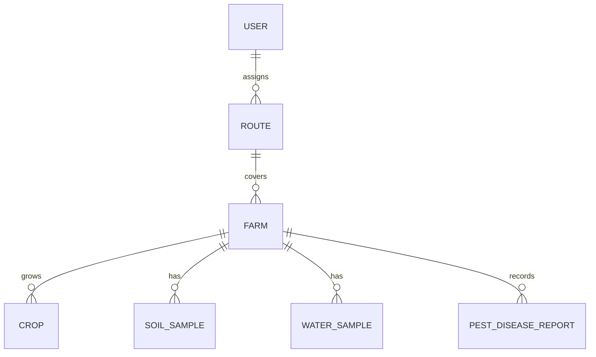
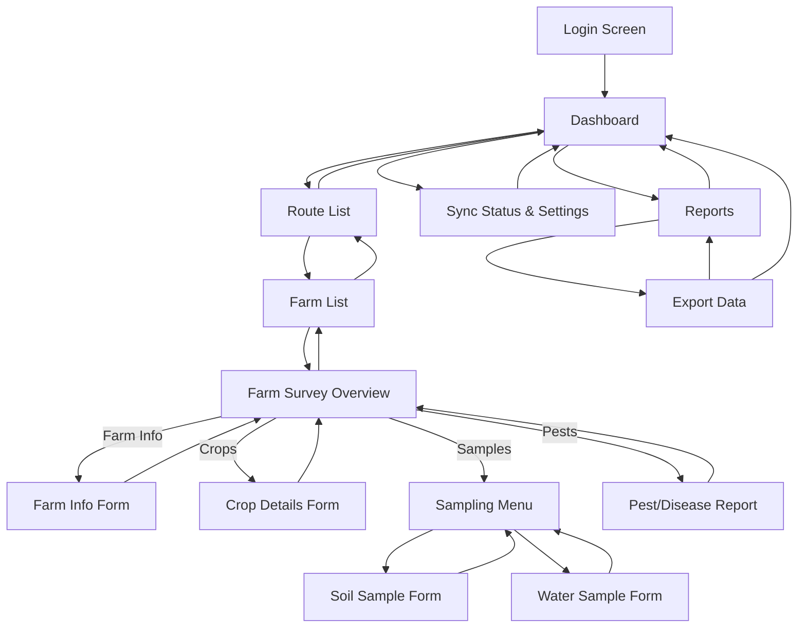
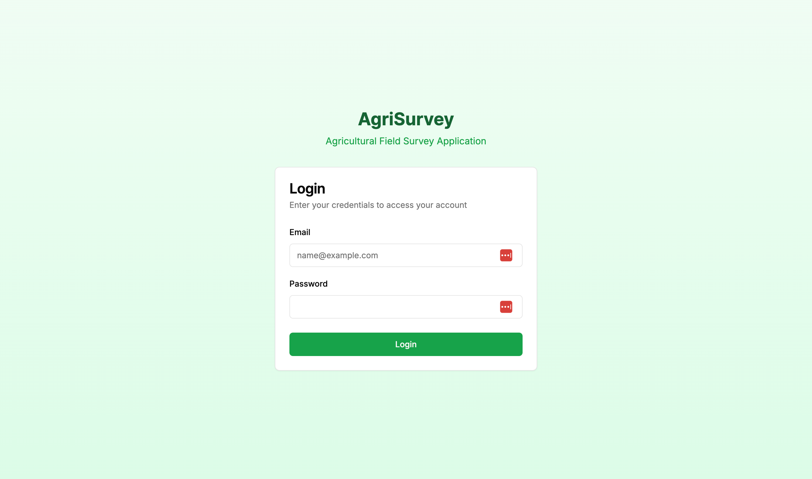
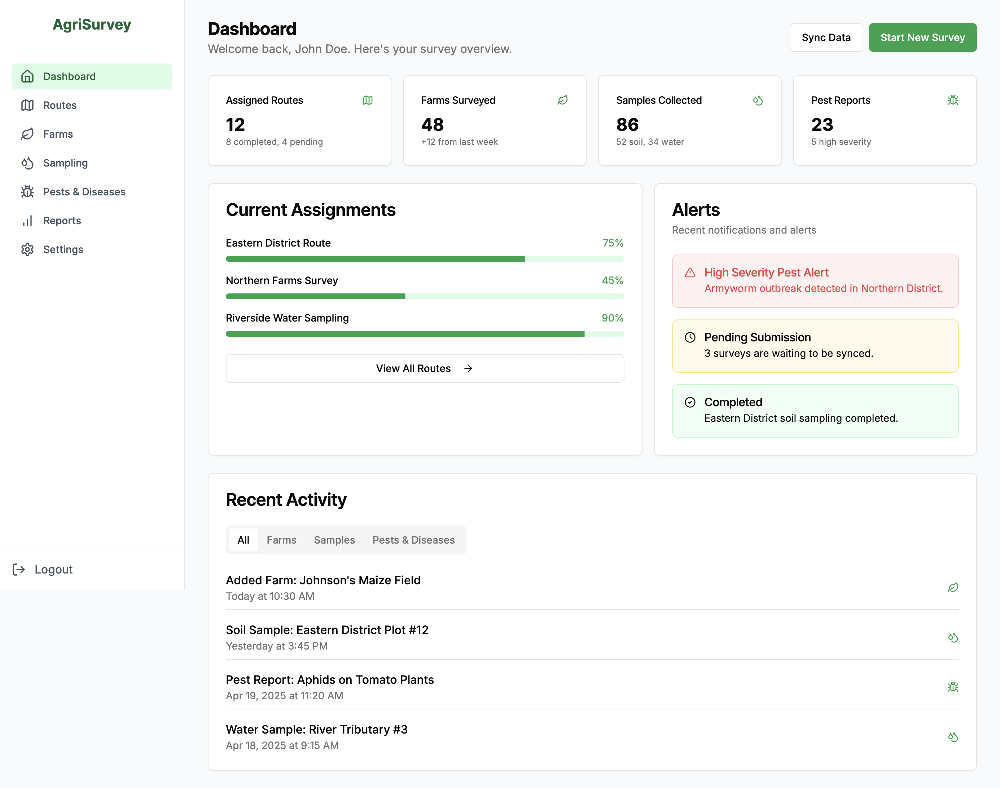
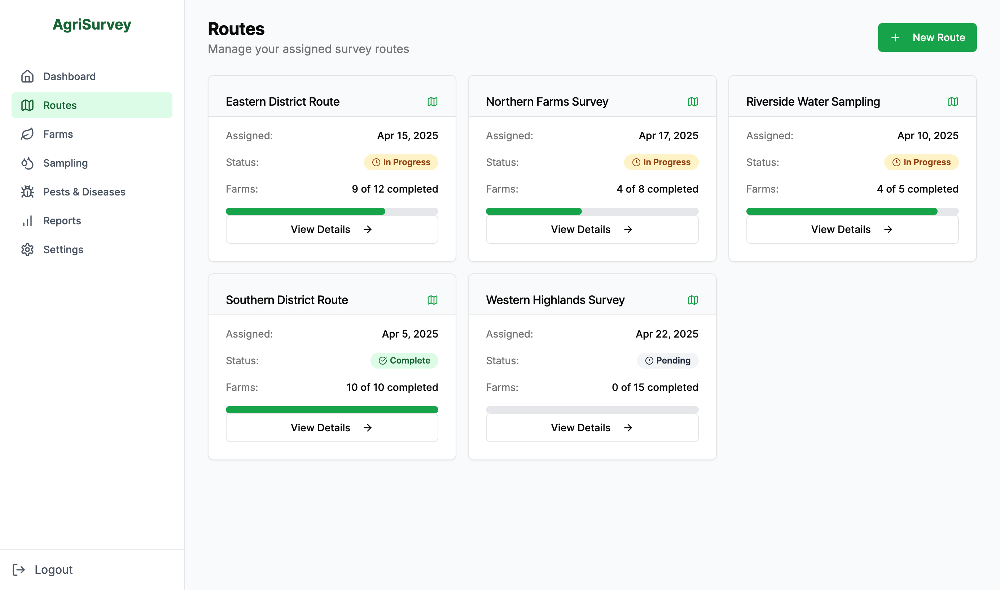
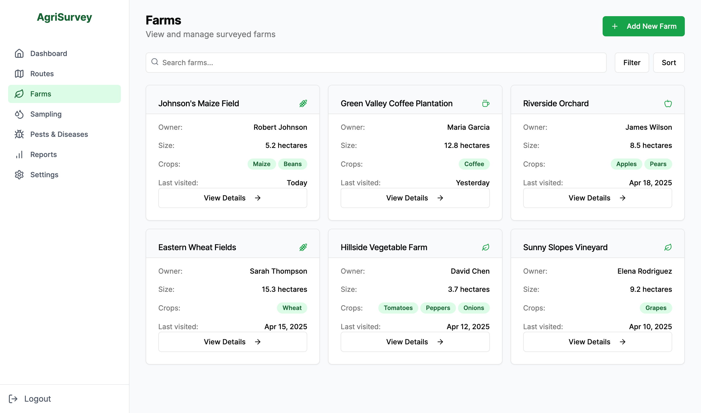
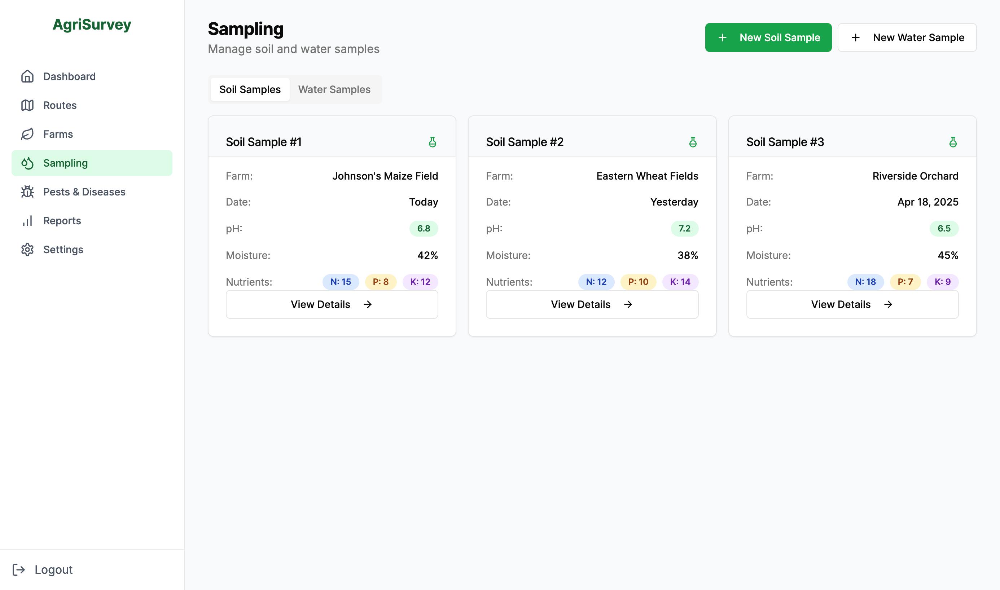
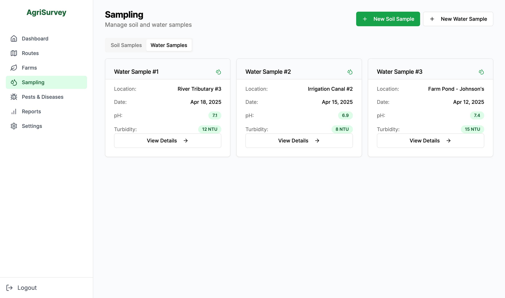
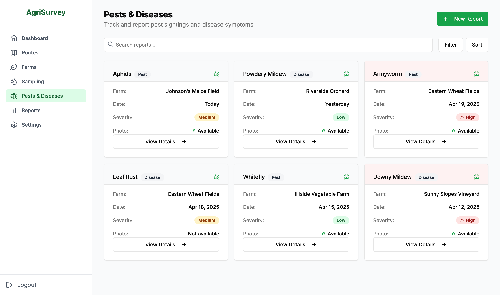

# AgriSurvey

## Overview

AgriSurvey is a lightweight web application for conducting agricultural field surveys. It lets users record farm details, manage crop information, log soil and water samples, and report pests and diseases. Designed for intuitive, efficient data collection, it empowers better decision‑making and resource allocation in the agricultural sector. Enumerators can quickly capture and save data in the field, then sync to a central database when online.

The backend is built in Python using the Django framework with SQLite for storage, while the frontend uses HTML, CSS, and JavaScript to provide a responsive, interactive user experience.

The application is structured into four main modules:

1. **Auth & Route Assignment**: This module handles user authentication and assigns specific fields or farms to each enumerator.
2. **Farm & Crop Details**: This module allows users to record essential information about the farm, including size, owner details, GPS boundaries, and the crops planted.
3. **Soil & Water Sampling**: This module enables users to log soil parameters such as pH, moisture, and nutrient levels, as well as upload water quality photos and readings.
4. **Pest & Disease Reporting**: This module captures pest sightings and disease symptoms, allowing users to upload photos and text descriptions. It also includes a feature to flag hotspots and alert agronomists.

## Features

- User authentication and role-based access control
- Field assignment for enumerators
- Farm details entry (size, owner info, GPS boundaries)
- Crop information management (planted crops and varieties)
- Soil sampling (pH, moisture, nutrient levels)
- Water sampling (quality photos and readings)
- Pest and disease reporting (photos and text)
- Hotspot flagging and agronomist alerts
- Responsive design for mobile and desktop
- SQLite database for data storage

## Modules and Functions

### 1. Auth
- **Login**: Secure login for enumerators and admins

### 2. Farm
- **Add Farm**: Add new farm details
- **View Farms**: View list of farms

### 3. Sampling
- **Add Soil Sample**: Add soil sample details
- **Add Water Sample**: Add water sample details
- **View Soil Samples**: View list of soil samples
- **View Water Samples**: View list of water samples

### 4. Pest & Disease
- **Add Pest/Disease Report**: Add pest and disease report details
- **View Pest/Disease Report**: View pest and disease reports

### 5. Dashboard
- **Dashboard**: Overview of all farms, crops, and samples from mockup data

### 6. Reports
- **Download Data**: Export data in CSV format

## Project Scope

- Create initial database schema and models
- Integrate Django ORM with postgreSQL
- Implement simple user authentication <!-- use default username and password -->
- Dashboard with mockup data
- Build basic UI for view and add:
    - Route assignment
    - Farm details entry
    - Crop information management
    - Soil sampling
    - Water sampling
- Host the application on a serverless platform (e.g., Fly.io, AWS Lambda)

## Data Model

### 1. Auth & Route Assignment

```yaml
User:
  type: object
  properties:
    id: { type: string, format: uuid }
    name: { type: string }
    email: { type: string, format: email }
    role: { type: string, enum: [admin, enumerator] }
  required: [id, name, email, role]

Route:
  type: object
  properties:
    id: { type: string, format: uuid }
    assignedTo: { type: string, format: uuid } # → User.id
    dateAssigned: { type: string, format: date }
    status: { type: string, enum: [pending, in_progress, complete] }
  required: [id, assignedTo, dateAssigned]
```

### 2. Farm & Crop Details

```yaml
Farm:
  type: object
  properties:
    id: { type: string, format: uuid }
    routeId: { type: string, format: uuid } # → Route.id
    ownerName: { type: string }
    sizeHa: { type: number } # hectares
    boundaryGeo: { type: object } # GeoJSON polygon
    createdAt: { type: string, format: date‑time }
  required: [id, routeId, ownerName, sizeHa]

Crop:
  type: object
  properties:
    id: { type: string, format: uuid }
    farmId: { type: string, format: uuid } # → Farm.id
    cropType: { type: string }
    variety: { type: string }
    plantingDate: { type: string, format: date }
    expectedHarvest: { type: string, format: date }
  required: [id, farmId, cropType, plantingDate]
```

### 3. Soil & Water Sampling

```yaml
SoilSample:
  type: object
  properties:
    id: { type: string, format: uuid }
    farmId: { type: string, format: uuid } # → Farm.id
    sampleDate: { type: string, format: date }
    pH: { type: number }
    moisturePct: { type: number }
    nutrients: # N, P, K values
      type: object
      properties:
        N: { type: number }
        P: { type: number }
        K: { type: number }
    photoUrl: { type: string, format: uri }
  required: [id, farmId, sampleDate, pH]

WaterSample:
  type: object
  properties:
    id: { type: string, format: uuid }
    farmId: { type: string, format: uuid } # → Farm.id
    sampleDate: { type: string, format: date }
    pH: { type: number }
    turbidity: { type: number }
    photoUrl: { type: string, format: uri }
  required: [id, farmId, sampleDate, pH]
```

### 4. Pest & Disease Reporting

```yaml
PestDiseaseReport:
  type: object
  properties:
    id: { type: string, format: uuid }
    farmId: { type: string, format: uuid } # → Farm.id
    reportDate: { type: string, format: date }
    category: { type: string, enum: [pest, disease] }
    name: { type: string }
    severity: { type: string, enum: [low, medium, high] }
    description: { type: string }
    photoUrl: { type: string, format: uri }
    location: # GPS optional override
      type: object
      properties:
        lat: { type: number }
        lng: { type: number }
  required: [id, farmId, reportDate, category, name]
```

### ER Diagram



## UI Flow



## UI/UX Design

### 1. Authentication



### 2. Dashboard



### 3. Route List



### 4. Farm List



### 5. Sampling

### 5.1 Soil Sample



### 5.2 Water Sample



### 6. Pest/Disease Report



---

# Project Planning

Project: **AgriSurvey** a web app for agricultural field data collection
Communication: **Microsoft Teams** (link to be send via email)
Standup: **Daily at 10 AM** (UTC+3)

## Project Team

- **Product Owner**: [Your Name]
- **Project Manager**: [Your Name]
- **Software Engineer**: [Your Name]
- **Software Engineer**: [Your Name]
- **QA Engineer**: [Your Name]

## Goals & Scope:

- **Goal**: Enable enumerators to authenticate, record farm, crop, soil/water and pest reports offline/online  
- **Core MVP**: Basic admin dashboard with coverage stats and CSV export  

## Deliverables:

- Project charter (roles, tech stack: Django + PostgreSQL, HTML/CSS/JS)
- Initial ER diagram & database schema

## Product Backlog as user‑story

| ID  | User Story                                                                                  | Est. Points |
|-----|---------------------------------------------------------------------------------------------|:-----------:|
| US1 | As an Enumerator, I can log in so that only authorized users collect data.                  |      3      |
| US2 | As an Enumerator, I can record Farm details (address, owner, GPS, photo).                   |      5      |
| US3 | As an Enumerator, I can record Crop information (type, variety, dates).                     |      3      |
| US4 | As an Enumerator, I can log Soil samples (pH, moisture, nutrients, photo).                  |      5      |
| US5 | As an Enumerator, I can log Water samples (pH, turbidity, photo).                           |      5      |
| US6 | As an Enumerator, I can report Pests/Diseases (category, severity, photo).                  |      5      |
| US7 | As an Enumerator, I can work offline and sync data when online.                              |      8      |
| US8 | As an Admin, I can view a dashboard with survey completion rates and export CSV reports.    |      5      |

## Sprint Planning

- **Sprint 1**  
  - US1 (Login) & US2 (Farm Details)
    - Secure login
    - Persistent Farm form
    - Unit tests for login and Farm form
- **Sprint 2**  
  - US3 (Crop Info) & US4 (Soil Sampling)
    - CRUD flows for Crop and SoilSample
    - Integration tests for form validation
- **Sprint 3**
  - US5 (Water Sampling) & US6 (Pest/Disease Reporting)
    - CRUD flows for WaterSample and PestDiseaseReport
    - Integration tests for data integrity
- **Sprint 4**
  - US7 (Offline Sync) & US8 (Admin Dashboard)
    - Offline data storage and sync logic
    - Admin dashboard with mockup data
    - Unit tests for sync and dashboard

## Release Planning

- **Release 1.0**  
  - Core features: US1, US2, US3, US4
  - Target date: [Insert date]
  - Deployment: [Insert deployment method]
- **Release 2.0**
  - Additional features: US5, US6, US7
  - Target date: [Insert date]
  - Deployment: [Insert deployment method]
- **Release 3.0**
  - Final features: US8, bug fixes
  - Target date: [Insert date]
  - Deployment: [Insert deployment method]
